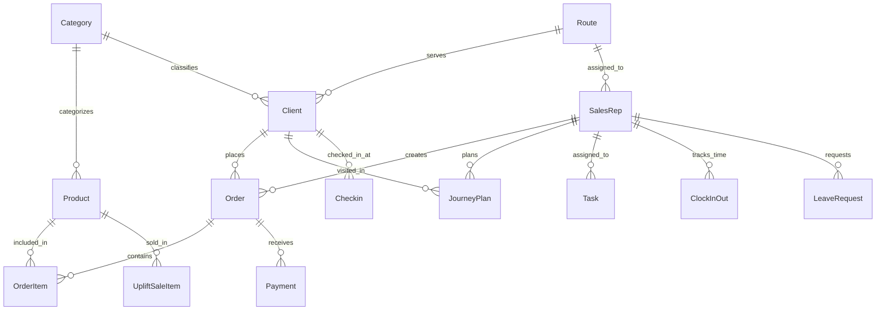

# KCC API Structure Breakdown

## Overview

The KCC API is built using **NestJS**, a progressive Node.js framework that provides excellent scalability and maintainability for enterprise applications. This document breaks down the complete structure and architecture of the API.

## Technology Stack

| Component | Technology | Version | Purpose |
|-----------|------------|---------|---------|
| **Framework** | NestJS | 10.x | Backend framework with dependency injection |
| **Language** | TypeScript | 5.x | Type-safe JavaScript |
| **Database** | MySQL | 8.x | Primary database (citlogis_ws) |
| **ORM** | TypeORM | 0.3.x | Database abstraction layer |
| **Authentication** | JWT + Passport | Latest | Token-based authentication |
| **File Upload** | Multer + Cloudinary | Latest | File handling and cloud storage |
| **Validation** | class-validator | Latest | Request validation |
| **Scheduling** | @nestjs/schedule | Latest | Background tasks |
| **Deployment** | Vercel | Latest | Serverless deployment |

## Project Architecture

```
kcc_api/
├── src/                          # Source code
│   ├── main.ts                   # Application entry point
│   ├── app.module.ts             # Root module configuration
│   ├── config/                   # Configuration files
│   ├── entities/                 # Database entities/models
│   ├── auth/                     # Authentication module
│   ├── users/                    # User management
│   ├── clients/                  # Client management
│   ├── products/                 # Product catalog
│   ├── orders/                   # Order management
│   ├── targets/                  # Sales targets
│   ├── journey-plans/            # Route planning
│   ├── notices/                  # Notice board
│   ├── analytics/                # Analytics & reporting
│   ├── tasks/                    # Task management
│   ├── uploads/                  # File uploads
│   ├── uplift-sales/             # Uplift sales tracking
│   ├── checkin/                  # Check-in system
│   ├── leave/                    # Leave management
│   ├── excel-import/             # Excel data import
│   ├── clock-in-out/             # Time tracking
│   ├── reports/                  # Reporting system
│   ├── routes/                   # Route management
│   ├── version/                  # Version control
│   ├── payments/                 # Payment processing
│   └── cloudinary/               # Cloud storage integration
├── dist/                         # Compiled JavaScript
├── uploads/                      # File storage
├── node_modules/                 # Dependencies
├── package.json                  # Project configuration
├── tsconfig.json                 # TypeScript configuration
├── vercel.json                   # Vercel deployment config
└── README.md                     # Project documentation
```

## Module Structure Analysis

### 1. Core Application Setup

#### `main.ts` - Application Bootstrap
```typescript
// Key Features:
- NestJS application factory
- CORS configuration
- Global validation pipe
- Static file serving
- Serverless function export (Vercel)
- Error handling middleware
```

#### `app.module.ts` - Root Module
```typescript
// Configuration:
- ConfigModule (environment variables)
- TypeOrmModule (database connection)
- JwtModule (authentication)
- MulterModule (file uploads)
- ScheduleModule (background tasks)
- All feature modules imported
```

### 2. Authentication System (`auth/`)

**Purpose**: Handles user authentication and authorization

**Components**:
- `auth.controller.ts` - Login/logout endpoints
- `auth.service.ts` - Authentication business logic
- `auth.module.ts` - Module configuration
- `guards/` - JWT and local authentication guards
- `strategies/` - Passport authentication strategies
- `dto/` - Data transfer objects for validation

**Key Features**:
- JWT token generation and validation
- Phone number + password authentication
- Role-based access control
- Session management

### 3. User Management (`users/`)

**Purpose**: Manages sales representatives and user profiles

**Components**:
- `users.controller.ts` - CRUD operations
- `users.service.ts` - Business logic
- `users.module.ts` - Module configuration
- `dto/` - User creation/update DTOs

**Key Features**:
- User CRUD operations
- Profile management
- Role assignment
- Soft delete functionality

### 4. Client Management (`clients/`)

**Purpose**: Comprehensive client/customer management system

**Components**:
- `clients.controller.ts` - Client operations
- `clients.service.ts` - Business logic
- `clients.module.ts` - Module configuration
- `dto/` - Client DTOs
- `entities/` - Client entity definitions

**Key Features**:
- Client CRUD operations
- Geographic search (latitude/longitude)
- Category-based filtering
- Route assignment
- Status management

### 5. Product Management (`products/`)

**Purpose**: Product catalog and inventory management

**Components**:
- `products.controller.ts` - Product operations
- `products.service.ts` - Business logic
- `products.module.ts` - Module configuration

**Key Features**:
- Product catalog management
- Category-based organization
- Country-specific pricing
- Stock tracking

### 6. Order Management (`orders/`)

**Purpose**: Sales order processing and management

**Components**:
- `orders.controller.ts` - Order operations
- `orders.service.ts` - Business logic
- `orders.module.ts` - Module configuration
- `dto/` - Order creation/update DTOs

**Key Features**:
- Order creation and management
- Order status tracking
- Order items management
- Delivery scheduling

### 7. Sales Targets (`targets/`)

**Purpose**: Sales performance tracking and goal management

**Components**:
- `targets.controller.ts` - Target operations
- `targets.service.ts` - Business logic
- `targets.module.ts` - Module configuration

**Key Features**:
- Monthly visit targets
- Performance dashboards
- Visit statistics
- Achievement tracking

### 8. Journey Planning (`journey-plans/`)

**Purpose**: Route planning and visit scheduling

**Components**:
- `journey-plans.controller.ts` - Journey plan operations
- `journey-plans.service.ts` - Business logic
- `journey-plans.module.ts` - Module configuration
- `entities/` - Journey plan entities

**Key Features**:
- Route planning
- Client visit scheduling
- Location-based optimization
- Visit tracking

### 9. Analytics (`analytics/`)

**Purpose**: Data analysis and performance metrics

**Components**:
- `analytics.controller.ts` - Analytics endpoints
- `analytics.service.ts` - Analytics business logic
- `analytics.module.ts` - Module configuration

**Key Features**:
- Performance metrics
- Daily login hours tracking
- Journey visit analytics
- Custom metric tracking

### 10. Task Management (`tasks/`)

**Purpose**: Task assignment and tracking

**Components**:
- `tasks.controller.ts` - Task operations
- `tasks.service.ts` - Business logic
- `tasks.module.ts` - Module configuration

**Key Features**:
- Task creation and assignment
- Status tracking
- Priority management
- Completion tracking

### 11. File Management (`uploads/`)

**Purpose**: File upload and storage management

**Components**:
- `uploads.controller.ts` - File upload endpoints
- `uploads.service.ts` - File handling logic
- `uploads.module.ts` - Module configuration

**Key Features**:
- File upload handling
- Cloud storage integration
- File type validation
- Storage management

### 12. Specialized Modules

#### Clock In/Out (`clock-in-out/`)
- Time tracking for sales representatives
- Location-based verification
- Work hour calculation

#### Leave Management (`leave/`)
- Leave request processing
- Approval workflows
- Leave type management

#### Excel Import (`excel-import/`)
- Bulk data import functionality
- Excel file processing
- Data validation

#### Reports (`reports/`)
- Sales reporting
- Performance analytics
- Custom report generation

#### Routes (`routes/`)
- Geographic route management
- Territory assignment
- Route optimization

#### Payments (`payments/`)
- Payment processing
- Transaction tracking
- Payment method management

## Database Architecture

### Entity Relationships



### Key Database Tables

1. **SalesRep** - Sales representatives
2. **Clients** - Customer/client information
3. **Products** - Product catalog
4. **Orders** - Sales orders
5. **OrderItems** - Order line items
6. **JourneyPlans** - Route planning
7. **Tasks** - Task management
8. **Targets** - Sales targets
9. **Notices** - Company announcements
10. **Analytics** - Performance metrics

## API Design Patterns

### 1. RESTful Design
- **GET** - Retrieve data
- **POST** - Create new resources
- **PATCH** - Update existing resources
- **DELETE** - Remove resources

### 2. Module Pattern
Each feature follows the NestJS module pattern:
```
module-name/
├── module-name.module.ts    # Module configuration
├── module-name.controller.ts # HTTP endpoints
├── module-name.service.ts   # Business logic
├── dto/                     # Data transfer objects
└── entities/                # Database entities
```

### 3. Dependency Injection
- Services injected into controllers
- Repository pattern for data access
- Configuration injected via ConfigService

### 4. Validation
- DTOs with class-validator decorators
- Global validation pipe
- Custom validation rules

### 5. Error Handling
- Global exception filters
- Standardized error responses
- Proper HTTP status codes

## Security Implementation

### 1. Authentication
- JWT token-based authentication
- Token expiration (9 hours)
- Secure token storage

### 2. Authorization
- Role-based access control
- Route-level guards
- User context validation

### 3. Data Validation
- Input sanitization
- Type validation
- Business rule validation

### 4. CORS Configuration
- Configurable origins
- Credential support
- Security headers

## Performance Optimizations

### 1. Database
- Stored procedures for complex queries
- Indexed foreign keys
- Connection pooling

### 2. Caching
- Response caching where appropriate
- Database query optimization
- Static file caching

### 3. File Handling
- Stream-based file processing
- Cloud storage integration
- File size limits

### 4. API Optimization
- Pagination for large datasets
- Selective field loading
- Efficient query patterns

## Deployment Architecture

### 1. Vercel Serverless
- Serverless function deployment
- Automatic scaling
- Global CDN

### 2. Environment Configuration
- Environment-specific configs
- Secure secret management
- Database connection pooling

### 3. Monitoring
- Application logging
- Error tracking
- Performance monitoring

## Development Workflow

### 1. Code Organization
- Feature-based module structure
- Consistent naming conventions
- Clear separation of concerns

### 2. Testing Strategy
- Unit tests for services
- Integration tests for controllers
- E2E tests for critical flows

### 3. Documentation
- Comprehensive API documentation
- Code comments and JSDoc
- Architecture documentation

## Scalability Considerations

### 1. Horizontal Scaling
- Stateless application design
- Database connection pooling
- Load balancing ready

### 2. Vertical Scaling
- Efficient memory usage
- Optimized database queries
- Resource monitoring

### 3. Future Enhancements
- Microservices architecture potential
- Event-driven architecture
- Real-time features (WebSockets)

## Best Practices Implemented

### 1. Code Quality
- TypeScript for type safety
- ESLint for code consistency
- Prettier for formatting

### 2. Security
- Input validation
- SQL injection prevention
- XSS protection

### 3. Performance
- Efficient database queries
- Response optimization
- Caching strategies

### 4. Maintainability
- Modular architecture
- Clear documentation
- Consistent patterns

## Conclusion

The KCC API demonstrates a well-structured, enterprise-grade NestJS application with:

- **Modular Architecture**: Clean separation of concerns
- **Scalable Design**: Ready for growth and expansion
- **Security Focus**: Comprehensive authentication and authorization
- **Performance Optimized**: Efficient database and API design
- **Developer Friendly**: Clear patterns and documentation

This architecture provides a solid foundation for the Woosh Flutter mobile application and can easily accommodate future enhancements and integrations.
