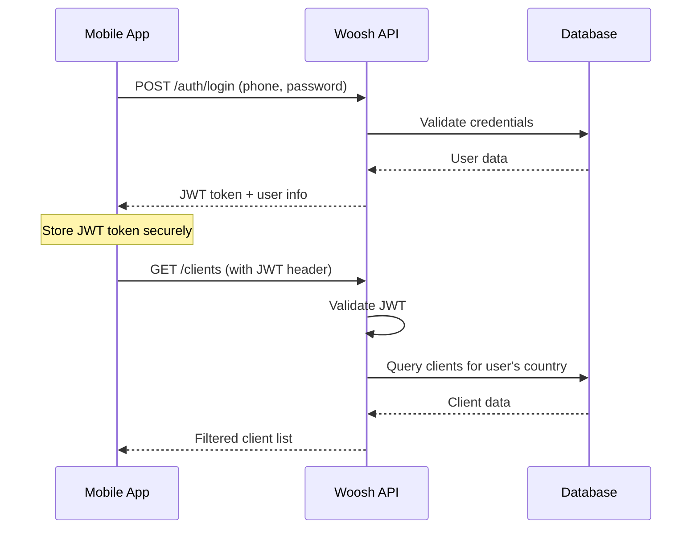

# Woosh API Documentation Package

Welcome to the complete documentation package for the Woosh API! This package contains everything you need to understand, integrate, and test the Woosh sales management API.

## 📚 Documentation Files

### 1. **API_DOCUMENTATION.md** - Complete API Reference
The comprehensive API documentation covering:
- All available endpoints (50+ endpoints)
- Request/response formats
- Authentication details
- Data models and schemas
- Error handling
- Environment configuration

**Best for:** Complete API reference, understanding all available features

### 2. **INTEGRATION_GUIDE.md** - Developer Integration Guide
Practical integration examples and patterns:
- Code examples in JavaScript, Python, Dart/Flutter
- Common integration patterns
- Error handling best practices
- Performance optimization
- Security guidelines
- Testing strategies

**Best for:** Developers implementing the API, learning integration patterns

### 3. **API_QUICK_REFERENCE.md** - Quick Reference
Fast lookup guide with:
- Most commonly used endpoints
- Quick examples
- Status codes
- Common parameters
- Validation rules

**Best for:** Quick lookups during development, cheat sheet

### 4. **Woosh_API.postman_collection.json** - Postman Collection
Ready-to-use Postman collection with:
- All API endpoints pre-configured
- Authentication setup
- Sample requests
- Environment variables
- Auto-token management

**Best for:** API testing, exploring endpoints, debugging

## 🚀 Quick Start Guide

### For API Consumers

1. **Start with the Quick Reference** (`API_QUICK_REFERENCE.md`)
   - Get familiar with common endpoints
   - Understand authentication flow
   - Try basic requests

2. **Use the Postman Collection**
   - Import `Woosh_API.postman_collection.json` into Postman
   - Set up your environment variables
   - Test login and basic endpoints

3. **Follow the Integration Guide** (`INTEGRATION_GUIDE.md`)
   - Choose your platform (JavaScript, Flutter, Python, etc.)
   - Copy relevant code examples
   - Implement error handling patterns

4. **Reference the Full Documentation** (`API_DOCUMENTATION.md`)
   - Understand all available endpoints
   - Check data models
   - Review advanced features

### For API Developers

1. **Review the Full Documentation** (`API_DOCUMENTATION.md`)
   - Understand the complete API structure
   - Check for missing documentation
   - Verify endpoint descriptions

2. **Test with Postman Collection**
   - Validate all endpoints work correctly
   - Check response formats
   - Test error scenarios

3. **Update Documentation as Needed**
   - Keep documentation in sync with code changes
   - Add new endpoints
   - Update examples

## 🔧 Setting Up Your Environment

### 1. Import Postman Collection

1. Open Postman
2. Click "Import" 
3. Select `Woosh_API.postman_collection.json`
4. Set environment variables:
   - `base_url`: Your API base URL (e.g., `http://localhost:3000/api`)
   - `jwt_token`: Will be auto-populated after login

### 2. Test Authentication

1. Use the "Authentication > Login" request
2. Update phone number and password
3. Send request - token will be automatically stored
4. Test "Authentication > Get Profile" to verify

### 3. Explore Endpoints

All requests in the collection are organized by feature:
- Authentication
- Users
- Clients
- Products
- Orders
- Journey Plans
- Clock In/Out
- Payments
- Leave Management
- Tasks
- Routes
- Analytics
- Uploads
- Excel Import
- Version & Health

## 📱 Platform-Specific Guides

### Flutter/Dart Developers
- Focus on the Flutter examples in `INTEGRATION_GUIDE.md`
- Use the `WooshApiService` class as a starting point
- Pay attention to multipart form data examples for file uploads

### JavaScript/React Developers
- Check the JavaScript examples in `INTEGRATION_GUIDE.md`
- Use the `ApiClient` class patterns
- Review the React Native examples for mobile apps

### Python Developers
- See Python examples in `INTEGRATION_GUIDE.md`
- Use the `requests` library patterns
- Adapt error handling for your framework

### Other Platforms
- Follow the HTTP request patterns in the documentation
- Use the Postman collection as a reference
- Implement similar error handling and authentication patterns

## 🔐 Authentication Flow



## 🌍 Geographic Filtering

The API automatically filters data based on the authenticated user's country:

- **Clients**: Only show clients in user's country
- **Routes**: Only show routes in user's country  
- **Products**: Can be filtered by country
- **Orders**: Only user's orders
- **Journey Plans**: Only user's plans

This ensures data isolation and security across different geographic regions.

## 📊 Data Models Overview

### Core Entities

```
SalesRep (Users)
├── countryId, region_id, route_id
├── targets (visits, new_clients, vapes, pouches)
└── role, status

Clients
├── Geographic data (latitude, longitude, region, route)
├── Contact info (name, email, phone, address)
└── Business data (balance, tax_pin, client_type)

Products
├── Basic info (name, category, description)
├── Pricing (unit_cost, unit_cost_ngn, unit_cost_tzs)
└── Stock (currentStock)

Orders
├── Order header (client, dates, totals)
└── Order items (product, quantity, pricing)

JourneyPlans
├── Visit planning (client, date, status)
└── Check-in/out tracking (times, coordinates)
```

## 🔄 Common Workflows

### 1. Daily Sales Workflow
```
1. Clock In → POST /clock-in-out/clock-in
2. Get Today's Journey Plans → GET /journey-plans/by-date
3. Visit Clients → Update journey plans
4. Create Orders → POST /orders
5. Upload Payments → POST /outlets/:clientId/payments
6. Submit Reports → POST /reports
7. Clock Out → POST /clock-in-out/clock-out
```

### 2. Client Management Workflow
```
1. Search Existing Clients → GET /clients/search
2. Find Nearby Clients → GET /clients/location/nearby
3. Create New Client → POST /clients
4. Update Client Info → PATCH /clients/:id
5. View Client Stats → GET /clients/stats/overview
```

### 3. Order Processing Workflow
```
1. Get Products → GET /products
2. Select Client → GET /clients
3. Create Order → POST /orders
4. Track Order → GET /orders/:id
5. Process Payment → POST /outlets/:clientId/payments
```

## 🛠️ Development Tools

### Postman Environment Setup

Create a Postman environment with these variables:

| Variable | Description | Example |
|----------|-------------|---------|
| `base_url` | API base URL | `http://localhost:3000/api` |
| `jwt_token` | Authentication token | Auto-populated after login |
| `user_id` | Current user ID | `1` |
| `client_id` | Test client ID | `1` |
| `product_id` | Test product ID | `1` |

### Testing Checklist

- [ ] Authentication works (login/logout)
- [ ] User profile retrieval
- [ ] Client CRUD operations
- [ ] Product listing
- [ ] Order creation and retrieval
- [ ] Journey plan management
- [ ] Clock in/out functionality
- [ ] Payment uploads
- [ ] File upload endpoints
- [ ] Geographic filtering
- [ ] Pagination
- [ ] Error handling

## 🚨 Important Notes

### Security Considerations
- **Never store JWT tokens in plain text**
- **Always use HTTPS in production**
- **Validate all input data**
- **Handle token expiration gracefully**
- **Implement proper error handling**

### Performance Tips
- **Use pagination for large datasets**
- **Cache frequently accessed data**
- **Implement offline-first patterns for mobile**
- **Batch API calls when possible**
- **Use geographic filtering to reduce data load**

### Mobile App Considerations
- **Handle network connectivity issues**
- **Implement proper loading states**
- **Use background sync for critical data**
- **Optimize for battery usage**
- **Handle app state changes (background/foreground)**

## 🐛 Troubleshooting

### Common Issues

1. **401 Unauthorized**
   - Check JWT token is included in header
   - Verify token hasn't expired (9-hour limit)
   - Ensure correct Authorization header format

2. **CORS Errors**
   - Verify your domain is in CORS configuration
   - Check protocol (http vs https)

3. **File Upload Failures**
   - Don't set Content-Type for FormData
   - Check file size (10MB limit)
   - Verify file format is supported

4. **Geographic Data Issues**
   - Validate coordinate ranges
   - Handle missing location data
   - Check country/region filtering

### Debug Mode

Enable debug logging by setting:
```env
LOG_LEVEL=debug
```

## 📞 Support

### Getting Help

1. **Check the Documentation**
   - Review relevant sections in the documentation files
   - Check the integration guide for your platform
   - Look at similar examples in the Postman collection

2. **Test with Postman**
   - Use the provided collection to test endpoints
   - Compare your requests with working examples
   - Check response formats

3. **Review Source Code**
   - Controller files: `src/*/controllers/*.ts`
   - Service files: `src/*/services/*.ts`
   - Entity definitions: `src/entities/*.ts`
   - DTO definitions: `src/*/dto/*.ts`

### Contact Information

For technical support:
- Review the source code in the `src/` directory
- Check existing issues and solutions
- Contact the development team

## 📋 Documentation Maintenance

### Keeping Documentation Updated

1. **When Adding New Endpoints**
   - Update `API_DOCUMENTATION.md`
   - Add to Postman collection
   - Update quick reference if commonly used
   - Add integration examples if complex

2. **When Changing Existing Endpoints**
   - Update all relevant documentation
   - Update Postman requests
   - Test all examples
   - Update version numbers

3. **When Adding New Features**
   - Document new modules
   - Add integration patterns
   - Update data models
   - Add testing examples

### Version Control

- Documentation version: `1.0.0`
- Last updated: `January 2024`
- API version: `1.0.0`

## 🎯 Next Steps

### For New Users
1. Import the Postman collection
2. Read the Quick Reference guide
3. Try the authentication flow
4. Explore basic endpoints (clients, products)
5. Follow integration examples for your platform

### For Experienced Developers
1. Review the complete API documentation
2. Implement error handling patterns
3. Set up offline-first architecture
4. Optimize for your specific use case
5. Contribute improvements back to documentation

## 📄 File Structure

```
📁 Woosh API Documentation/
├── 📄 API_DOCUMENTATION.md          # Complete API reference
├── 📄 INTEGRATION_GUIDE.md          # Developer integration guide  
├── 📄 API_QUICK_REFERENCE.md        # Quick lookup guide
├── 📄 Woosh_API.postman_collection.json  # Postman collection
├── 📄 DOCUMENTATION_README.md       # This file
└── 📄 README.md                     # Original project README
```

---

**Ready to get started?** 

1. 📖 Read the [Quick Reference](API_QUICK_REFERENCE.md) for common endpoints
2. 🔧 Import the [Postman Collection](Woosh_API.postman_collection.json) for testing
3. 💻 Follow the [Integration Guide](INTEGRATION_GUIDE.md) for your platform
4. 📚 Reference the [Complete Documentation](API_DOCUMENTATION.md) for details

Happy coding! 🚀